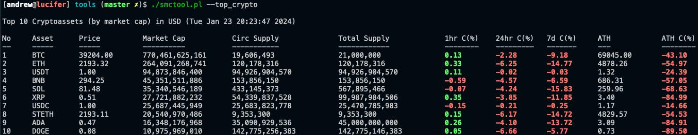
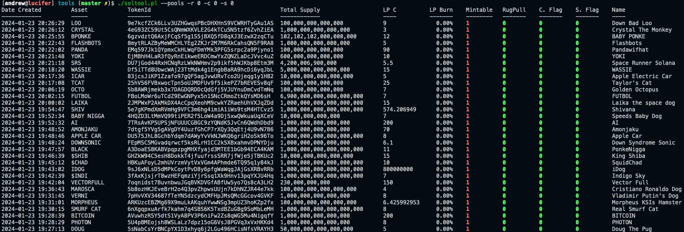

# Tools

## smctool.pl - Check Blockchain Smart Contract Health

Run checks against smart contract addresses and get their current health and activity status.
Get top crypto assets by rank (can also search by ticker).

```
smcTOOL v1.20-STABLE - Retrieve blockchain smart contract information.

Usage:
  --token_security     <-c|--cid -a|--address>  List smart contract attributes
  --approval_security  <-c|--cid -a|--address>  List attributes to identify malicious behaviour
  --rugpull_detect     <-c|--cid -a|--address>  List attributes to identify rug pull behaviour
  --nft_security       <-c|--cid -a|--address>  List attributes configured for NFTs
  --address_security   <-c|--cid -a|--address>  Check for malicious address
  --top_crypto         <-n|--num -s|--symbol>   Get top cryptoassets by market cap
  --query_api          <request>                Run an API query against an endpoint

Options:
  -o|output   <json|dumper>         Output format for API Query (Default=json)
  -c|cid      <chain id>            Blockchain ID
  -a|address  <blockhain address>   Smart Contract or Holder address
  -i|api      <cgo|gpl|cap|dex>     API Endpoint (gpl=GoPlusLabs, cgo=Coin Gecko, cap=Coin Cap, dex=DEX Screener)
  -m|mcap     <1|0>                 Show market cap summary (1=yes, 0=no)
  -n|num      <items>               Number of items to display for top cryptoassets
  -s|symbol   <currency>            Denonimated currency
  -t|ticker   <ticker>              Crypto ticker symbol
  -p|percent  <24hr percentage>     Filter results by percentage value
  --debug                           Enable verbose mode
  --help                            Print this help information
  --version                         Print version

References:

GoPlusLabs API Documentation   - https://docs.gopluslabs.io/reference/
Coin Gecko API Documentation   - https://www.coingecko.com/en/api/documentation
Coin Cap API Documentation     - https://docs.coincap.io/
DEX Screener API Documentation - https://docs.dexscreener.com/api/reference
```

## Screenshot



## soltool.pl - Check Solana Contract & Pools Health

Run checks against launched Solana contracts and get their current health and liquidity pool status.
Filter results based on a number of parameters.
Information obtained using pumpr.xyz.

```
solTOOL v1.7-STABLE - Retrieve solana contract & pools information.

Usage:
  --drops                       List new drops
  --pools   <-r|-m|-c|-s|-l>    List new liquidity pools

Options:
  -o|output    <json|dumper>    Output format for API Query (Default=json)
  -r|rugpull   <1|0>            List pools with rugpull flag set/unset
  -m|mintable  <1|0>            List pools with mintable flag set/unset
  -c|creator   <1|0>            List pools with creator flag set/unset
  -s|symbol    <1|0>            List pools with symbol flag set/unset
  -l|lp        <no>             List pools with liquidity pool size > value
  --debug                       Enable verbose mode
  --help                        Print this help information
  --version                     Print version
```

## Screenshot



# Dependencies

The tools will require the following modules for perl if not already installed.
cpanfile is included in distribution for CPAN installation.

```
requires 'JSON';
requires 'Readonly';
requires 'Getopt::Long';
requires 'MIME::Base64';
requires 'LWP::UserAgent';
```

Package names if installing from a debian'ish or rpm'ish system (may differ based
on distro release/application versions)

Debian/Ubuntu
```
libjson-perl
libreadonly-perl
libgetopt-long-descriptive-perl
libfile-mimeinfo-perl
libwww-perl
```

RPM
```
perl-JSON
perl-Readonly
perl-Getopt-Long
perl-File-MimeInfo
perl-libwww-perl
```
